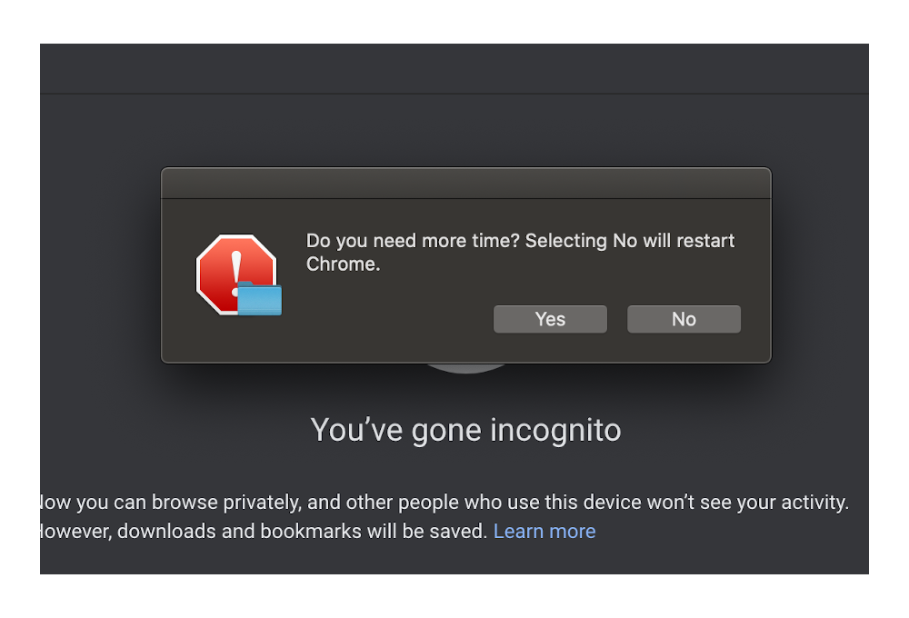

<div align="center">

# Secure Browser Kiosk

Restart Chrome in incognito mode by prompting the user if they need more time.

[](https://github.com/Justintime50/secure-browser-kiosk/actions)
[](LICENSE)



</div>

Secure Browser Kiosk is a macOS script that opens and closes Chrome in incognito mode and removes the user's downloads after prompting if the user needs more time (after 5 minutes of use) and they answer no.

## Install

```bash
# Setup the tap
brew tap justintime50/formulas

# Install the tool
brew install secure-browser-kiosk
```

To ensure the script can run uninterrupted, we'll need to do a few things first:

Ensure that all screen savers and timeouts for logout on your computer are turned off. If they are not, the script will be interrupted. These can be found in various places:

1. `System Preferences` -> `Desktop & Screen Saver` -> Start after: none (found in the bottom left corner)
1. `System Preferences` -> `Energy Saver` -> Never turn off or put to sleep
1. `Security & Privacy` -> `Advanced` -> Logout after settings (this can be turned on if you plan to use the script as a login item since it would be restarated after login anyway.)

## Usage

Either run the script as standalone or copy and load the Launch Agent (recommended).

Pass an optional seconds argument to override the default 300 (5 minutes) timeout.

### Standalone

```bash
secure-browser-kiosk 600
```

### Launch Agent (Recommended)

Loading Secure Browser Kiosk as a Launch Agent will hide any terminal actually running the script and will keep the script running once loaded. If loaded, the script will start automatically upon login.

**NOTE:** Make sure to update the plist script path in `local.secureBrowserKiosk.plist` before copying.

```bash
# Copy the plist to the Launch Agent directory
cp src/local.secureBrowserKiosk.plist ~/Library/LaunchAgents

# use `load/unload` to add/remove the script as a Launch Agent
launchctl load ~/Library/LaunchAgents/local.secureBrowserKiosk.plist

# To `start/stop` the script from running, use the following
launchctl start local.secureBrowserKiosk.plist
```
